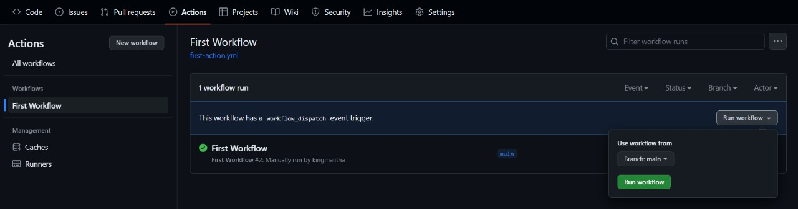

# GITHUB FIRST ACTION

- This is a simple action to demonstrate how to use a custom action in a workflow.

- This repository is a related to the main repository [learning-github-actions](https://github.com/kingmalitha/learning-github-actions.git). Please refer to the main repository for more information.

## STEPS:

1. Create a folder called `.github` in the root of your repository.
2. Inside the `.github` folder, create a folder called `workflows`.
3. Inside the `workflows` folder, create a file called `first-action.yml`. (You can name the file as you wish, but the extension should be `.yml`)
4. Copy the following code and paste it into the `first-action.yml` file.

   ```yml
   name: First Workflow  # Name of the workflow
   on: workflow_dispatch  # Event that triggers the workflow, in this case, it is a manual trigger, There are many other events that can be used to trigger the workflow. We will discuss them later.
   jobs:
   first-job: # Name of the job
       runs-on: ubuntu-latest  # The type of the runner that the job will run on.
       - name: Print greeting        # Name of the step
           run: echo "Hello World!"    # The command that the step will run
       - name: Print goodbye
           run: echo "Done- bye!"
   ```

5. Commit and push the changes to the repository.

6. Go to the `Actions` tab in the repository and you will see the workflow that you just created.

7. Click on the `First Workflow` and click on the `Run workflow` button.

   

8. You will see the workflow running.

9. Once the workflow is completed, you will see the output of the workflow.

10. You can click on related links to see the logs and other details of the workflow.

    

## Conclusion

- This is a simple example of how to create a workflow in GitHub Actions. We will discuss more advanced topics in the future. Please refer to the main repository for more information.
